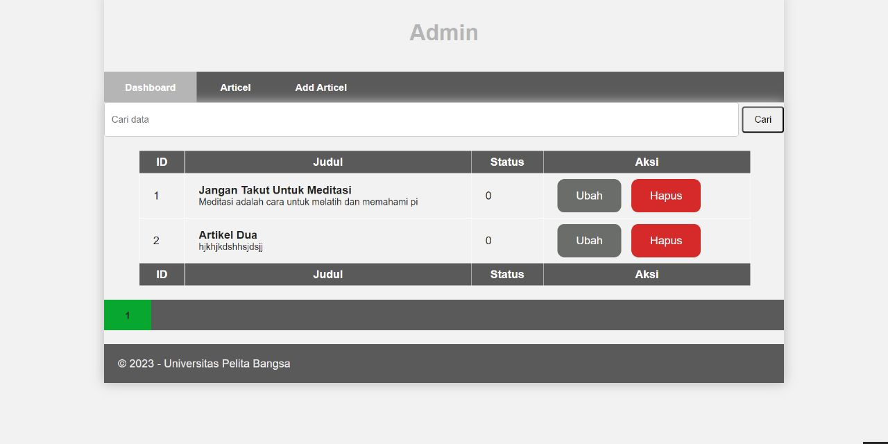
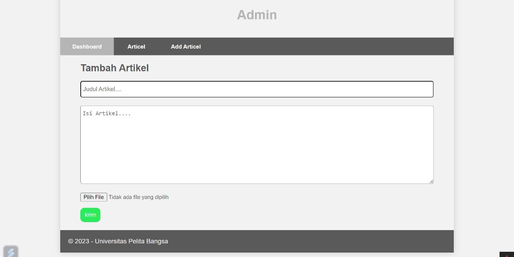

# Lab11Web

## Profil
| #               | Biodata              |
| --------------- | -----------------    |
| **Nama**        | Anindia Sasikirana   |
| **NIM**         | 312110268            |
| **Kelas**       | TI.21.A.2            |
| **Mata Kuliah** | Pemrograman Web 2    |


# 1. Menambahkan field input pada file views/artikel/from_add.php seperti berikut.

```
<p>
<input type="file" name="gambar">
</p>
```

## Penjelasan 

- <p> adalah elemen paragraf HTML yang digunakan untuk mengelompokkan elemen-elemen dalam satu blok teks.

- <input> adalah elemen input HTML yang memungkinkan pengguna untuk memasukkan data.

- type="file" adalah atribut pada elemen input yang menentukan tipe input sebagai "file". Ini berarti elemen input akan memungkinkan pengguna untuk memilih file dari sistem lokal mereka.

- name="gambar" adalah atribut pada elemen input yang menentukan nama variabel ketika formulir dikirimkan. Ketika formulir dikirimkan, file gambar yang dipilih oleh pengguna akan dikirimkan dengan nama "gambar". Anda dapat menggunakan nama variabel ini untuk memproses file gambar di sisi server.

- <p> menutup elemen paragraf HTML yang telah dibuka sebelumnya.


# 2. Sesuaikan tag from dengan menambahkan seperti berikut.

```
<form action="" method="post" enctype="multipart/form-data">
```

# Penjelasan 

- <form> adalah elemen HTML yang digunakan untuk membuat formulir di dalam halaman web.

- action="" adalah atribut pada elemen form yang menentukan URL atau alamat tujuan di mana data formulir akan dikirimkan. Dalam contoh ini, nilai atribut action dikosongkan (""), yang berarti data formulir akan dikirimkan ke URL halaman saat ini.

- method="post" adalah atribut pada elemen form yang menentukan metode HTTP yang akan digunakan untuk mengirimkan data formulir. Dalam kasus ini, metode POST digunakan, yang berarti data formulir akan dikirimkan dalam badan permintaan HTTP POST.

- enctype="multipart/form-data" adalah atribut pada elemen form yang menentukan jenis konten (encoding type) yang akan digunakan saat mengirimkan data formulir. Dalam hal ini, "multipart/form-data" digunakan untuk mengizinkan pengiriman file dan data biner lainnya melalui formulir. Ini diperlukan ketika  ingin mengunggah file melalui elemen input tipe file.


# OUTPUT 



